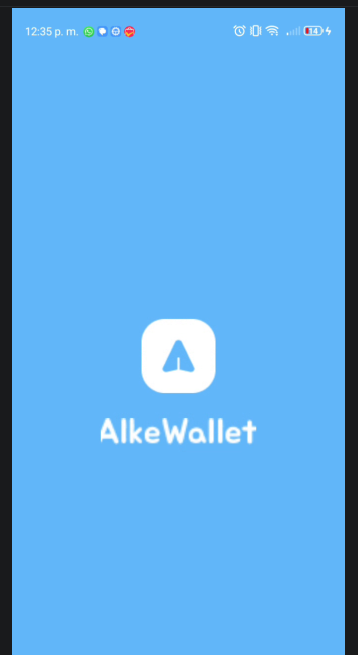

# Alke Wallet App

Aplicación móvil desarrollada en Android que simula una billetera digital.
Permite gestionar saldo, visualizar información del usuario y realizar operaciones básicas dentro de la aplicación.

---

## Descripción del proyecto

**Alke Wallet** es una aplicación desarrollada como proyecto de aprendizaje en desarrollo móvil Android.
La aplicación incluye una pantalla de inicio, interfaz gráfica personalizada y manejo de componentes básicos de Android.

---

## Capturas de pantalla

### Splash Screen (Pantalla de inicio)



### Pantalla de inicio


### Pantalla principal


### Formulario de usuario


---

## ⚙️ Tecnologías utilizadas

* Java
* Android SDK
* XML Layouts
* Android Studio
* Git y GitHub

---

## 📂 Estructura del proyecto

```
AlkeWalletApp
│
├── app
│   ├── src
│   │   ├── main
│   │   │   ├── java
│   │   │   ├── res
│   │   │   │   ├── layout
│   │   │   │   ├── drawable
│   │   │   │   └── values
│   │   │   └── AndroidManifest.xml
│   │
│   └── build.gradle
│
└── README.md
```

---

## 🚀 Instalación

1. Clonar el repositorio

```
git clone https://github.com/tuusuario/alkewalletapp.git
```

2. Abrir el proyecto en Android Studio

3. Ejecutar la aplicación en un emulador o dispositivo físico

---

## 👩‍💻 Autor

Nicole Pinilla
Proyecto realizado como práctica de desarrollo de aplicaciones móviles Android.

---

## 📄 Licencia

Este proyecto es de uso educativo.
